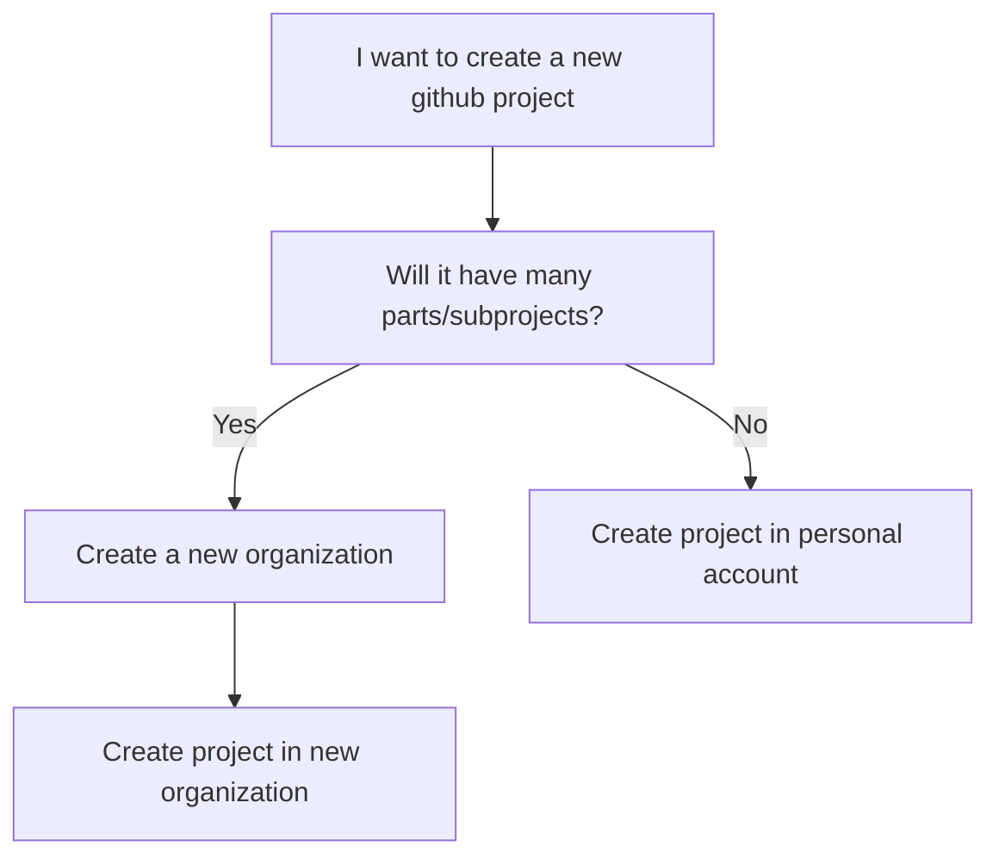

```mermaid
graph TD;
	0[I want to create a new github project]
	0 --> 1[Will it have many parts/subprojects?]
	1 --> |Yes| 2[Create a new organization]
		2 --> 4[Create project in new organization]
	1 --> |No| 3[Create project in personal account]
```